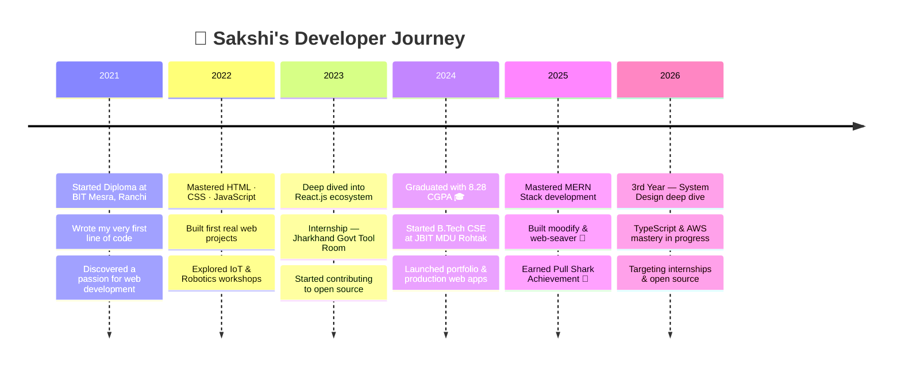

<!-- ═══════════════════════════════════════════════════════════ -->
<!--                       HEADER BANNER                        -->
<!-- ═══════════════════════════════════════════════════════════ -->
<div align="center">
  
</div>

<!-- ═══════════════════════════════════════════════════════════ -->
<!--                    TYPING ANIMATION                        -->
<!-- ═══════════════════════════════════════════════════════════ -->
<p align="center">
  
</p>

<!-- ═══════════════════════════════════════════════════════════ -->
<!--                    STATUS BADGES                           -->
<!-- ═══════════════════════════════════════════════════════════ -->
<div align="center">

  [](https://github.com/thesakshigupta)
  [](https://github.com/thesakshigupta?tab=followers)
  [](https://github.com/thesakshigupta)
  

</div>

<!-- ═══════════════════════════════════════════════════════════ -->
<!--                    SOCIAL LINKS                            -->
<!-- ═══════════════════════════════════════════════════════════ -->
<div align="center">

  [](https://know-meee.vercel.app/)
  [](https://www.linkedin.com/in/webdevelopersakshigupta/)
  [](mailto:sakshisatya2311@gmail.com)
  [](https://github.com/thesakshigupta)

</div>

<br/>


<!-- ═══════════════════════════════════════════════════════════ -->
<!--                      ABOUT ME                              -->
<!-- ═══════════════════════════════════════════════════════════ -->
##  &nbsp;`$ cat about_me.json`

<table>
<tr>
<td width="54%" valign="top">

```json
{
  "name": "Sakshi Gupta",
  "role": "Full Stack Web Developer",
  "location": "Haryana, India 🇮🇳",
  "education": {
    "degree": "B.Tech — Computer Science Engg.",
    "college": "JBIT, MDU Rohtak",
    "year": "3rd Year (2026)"
  },
  "stack": ["React", "Next.js", "Node.js", "MongoDB"],
  "currently_building": ["moodify 🎵", "web-seaver 🌐"],
  "learning": ["TypeScript", "System Design", "AWS"],
  "achievement": "Pull Shark 🦈 — GitHub Badge",
  "open_to": ["Internships", "Open Source", "Collabs"],
  "fun_fact": "I turn ☕ coffee into clean code"
}
```

</td>
<td width="46%" valign="top" align="center">


<br/>

🔭 &nbsp;Building [moodify](https://github.com/thesakshigupta/moodify) & [web-seaver](https://github.com/thesakshigupta/web-seaver)  
🌱 &nbsp;Mastering **TypeScript · System Design · AWS**  
🦈 &nbsp;Earned **Pull Shark** — GitHub Achievement  
📍 &nbsp;Based in **Haryana, India**  
💼 &nbsp;**Open to Internships & Projects**  

</td>
</tr>
</table>

<!-- GitHub WidgetBox -->
<div align="center">
  <a href="https://github.com/thesakshigupta">
    
  </a>
</div>


<!-- ═══════════════════════════════════════════════════════════ -->
<!--                     TECH STACK                             -->
<!-- ═══════════════════════════════════════════════════════════ -->
##  &nbsp;`$ ls -la ~/tech-stack/`

<div align="center">

**⚡ Frontend**


<br/>

**🗄️ Backend & Databases**


<br/>

**🛠️ Tools & Platforms**


<br/>

**💻 Languages**


</div>

<br/>

<div align="center">

| Technology | Proficiency | Projects |
|:---:|:---:|:---:|
|  React.js | ████████████░░ 90% | 10+ |
|  JavaScript | █████████████░ 95% | 15+ |
|  Next.js | ██████████░░░░ 75% | 5+ |
|  Tailwind CSS | ███████████░░░ 85% | 8+ |
|  Node.js | █████████░░░░░ 70% | 4+ |

</div>


<!-- ═══════════════════════════════════════════════════════════ -->
<!--                    GITHUB STATS                            -->
<!-- ═══════════════════════════════════════════════════════════ -->
##  &nbsp;`$ git log --oneline --graph`

<!-- Activity Graph -->
<p align="center">
  
</p>

<!-- Stats + Streak Side by Side -->
<div align="center">
  
  
</div>

<!-- Top Languages -->
<div align="center">
  
</div>

<!-- Profile Summary Cards -->
<div align="center">
  
</div>
<div align="center">
  
  
  
</div>


<!-- ═══════════════════════════════════════════════════════════ -->
<!--                TROPHIES & ACHIEVEMENTS                     -->
<!-- ═══════════════════════════════════════════════════════════ -->
##  &nbsp;`$ cat achievements.log`

<div align="center">
  
</div>

<br/>

<div align="center">
  
  
  
  
</div>


<!-- ═══════════════════════════════════════════════════════════ -->
<!--                  FEATURED PROJECTS                         -->
<!-- ═══════════════════════════════════════════════════════════ -->
##  &nbsp;`$ tree ~/projects/`

<div align="center">
<table>
<tr>
<td width="50%" valign="top">

### 🎵 Moodify
> Music & mood-based web experience that adapts to your vibe

[](https://github.com/thesakshigupta/moodify)

`React` &nbsp; `JavaScript` &nbsp; `TailwindCSS` &nbsp; `API`

</td>
<td width="50%" valign="top">

### 🌐 Web-Seaver
> Save & organize internet content you love, all in one place

[](https://github.com/thesakshigupta/web-seaver)

`React` &nbsp; `Node.js` &nbsp; `MongoDB` &nbsp; `Express`

</td>
</tr>
<tr>
<td width="50%" valign="top">

### 💼 Know Me — Portfolio
> Stunning personal portfolio with Framer Motion animations

[](https://know-meee.vercel.app/)
[](https://github.com/thesakshigupta/know-me)

`Next.js` &nbsp; `React` &nbsp; `Framer Motion` &nbsp; `TailwindCSS`

</td>
<td width="50%" valign="top">

### 📊 React Dashboard
> Feature-rich admin dashboard with analytics & UI components

[](https://github.com/thesakshigupta/react-dashboard)

`React` &nbsp; `TailwindCSS` &nbsp; `JavaScript` &nbsp; `Charts`

</td>
</tr>
</table>
</div>

<div align="center">
  <a href="https://github.com/thesakshigupta?tab=repositories">
    
  </a>
</div>


<!-- ═══════════════════════════════════════════════════════════ -->
<!--                  DEVELOPER JOURNEY                         -->
<!-- ═══════════════════════════════════════════════════════════ -->
##  &nbsp;`$ history | grep journey`



<br/>

<div align="center">

| 🎓 Degree | 🏛️ Institution | 📅 Duration | 📊 Result |
|:---|:---|:---:|:---:|
| **B.Tech — Computer Science Engg.** | JBIT, MDU Rohtak | 2024 – Present | *Pursuing (3rd Year)* |
| **Diploma — Computer Engineering** | BIT Mesra, Ranchi | 2021 – 2024 | **8.28 CGPA** ⭐ |
| **10th Standard** | Stronnat High School | 2020 – 2021 | **85.40%** 🏆 |

</div>


<!-- ═══════════════════════════════════════════════════════════ -->
<!--                     DEV QUOTE                              -->
<!-- ═══════════════════════════════════════════════════════════ -->
##  &nbsp;`$ fortune`

<div align="center">
  
</div>

```
╔══════════════════════════════════════════════════════════════════╗
║                                                                  ║
║   "First, solve the problem. Then, write the code."             ║
║                                             — John Johnson       ║
║                                                                  ║
╚══════════════════════════════════════════════════════════════════╝
```


<!-- ═══════════════════════════════════════════════════════════ -->
<!--                   CONNECT SECTION                          -->
<!-- ═══════════════════════════════════════════════════════════ -->
##  &nbsp;`$ ping sakshi`

<div align="center">

### 🤝 Open to internships, collaborations & open source!

<br/>

<a href="https://www.linkedin.com/in/webdevelopersakshigupta/">
  
</a>
&nbsp;
<a href="mailto:sakshisatya2311@gmail.com">
  
</a>
&nbsp;
<a href="https://know-meee.vercel.app/">
  
</a>
&nbsp;
<a href="https://github.com/thesakshigupta">
  
</a>

<br/><br/>

<!-- Contribution Snake Animation -->
<picture>
  <source media="(prefers-color-scheme: dark)" srcset="https://raw.githubusercontent.com/thesakshigupta/thesakshigupta/output/github-contribution-grid-snake-dark.svg"/>
  <source media="(prefers-color-scheme: light)" srcset="https://raw.githubusercontent.com/thesakshigupta/thesakshigupta/output/github-contribution-grid-snake.svg"/>
  
</picture>

</div>


<!-- ═══════════════════════════════════════════════════════════ -->
<!--                    SHOW SOME LOVE                          -->
<!-- ═══════════════════════════════════════════════════════════ -->
<div align="center">

### 💜 If you like my work, star my repos & let's connect!

<a href="https://github.com/thesakshigupta?tab=repositories">
  
</a>

<br/><br/>


<br/>
<sub>👁️ You are one of my amazing visitors!</sub>

</div>

<!-- ═══════════════════════════════════════════════════════════ -->
<!--                       FOOTER                               -->
<!-- ═══════════════════════════════════════════════════════════ -->
<div align="center">
  
</div>

<div align="center">
  <sub>✨ Crafted with 💜 by <a href="https://github.com/thesakshigupta">Sakshi Gupta</a> · © 2026 · Haryana, India 🇮🇳</sub>
</div>

<!--
  Hey fellow developer! If you're reading the source, you're awesome! 👋
  Feel free to fork this README and make it your own. Happy coding! 🚀
  — Sakshi
-->
